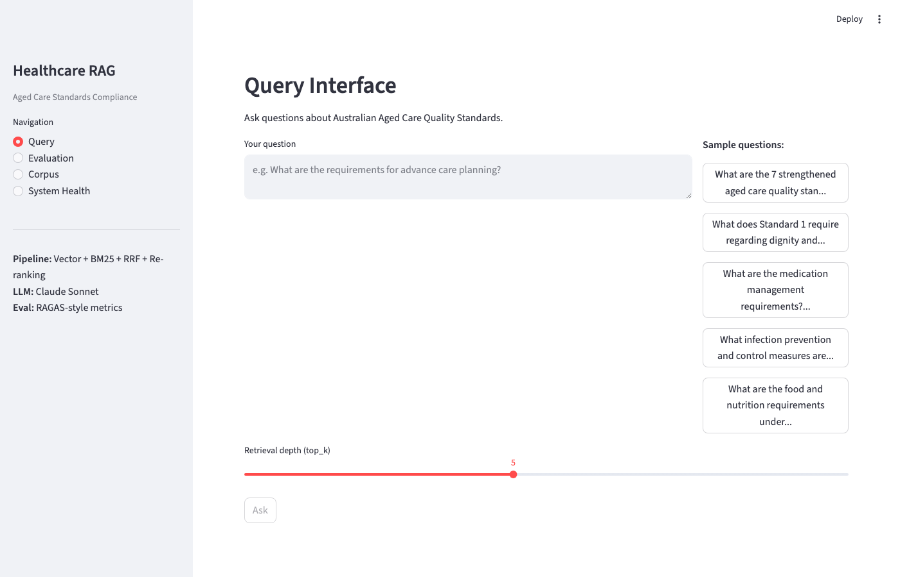
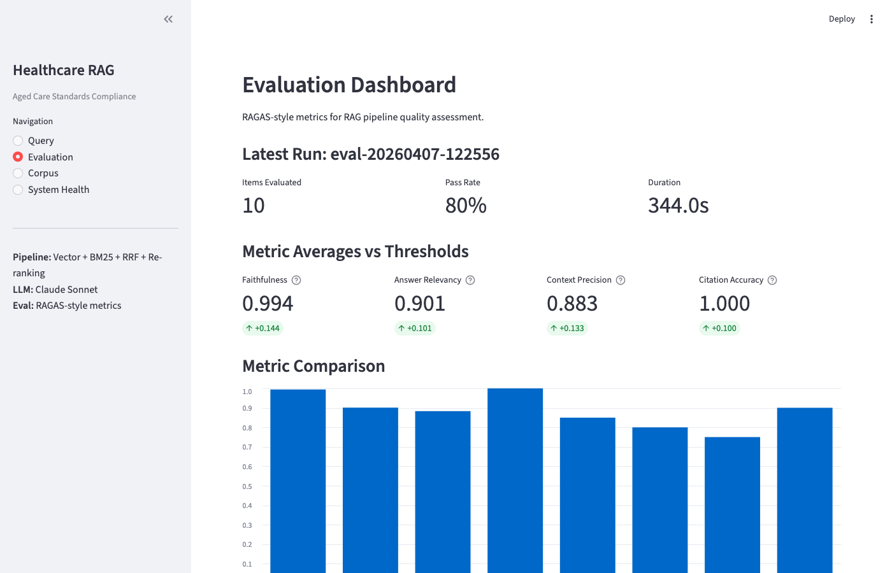
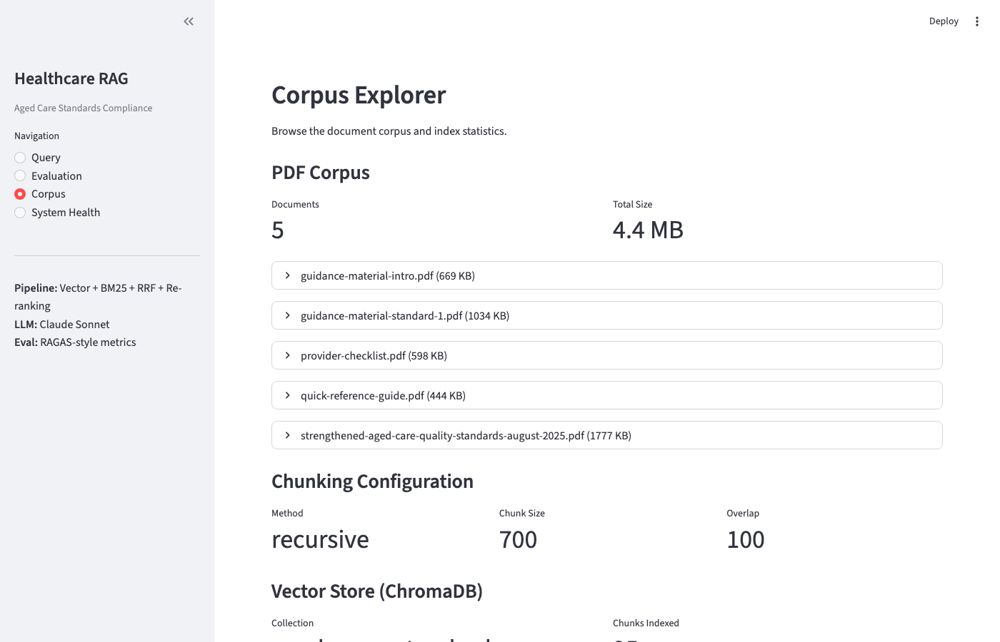
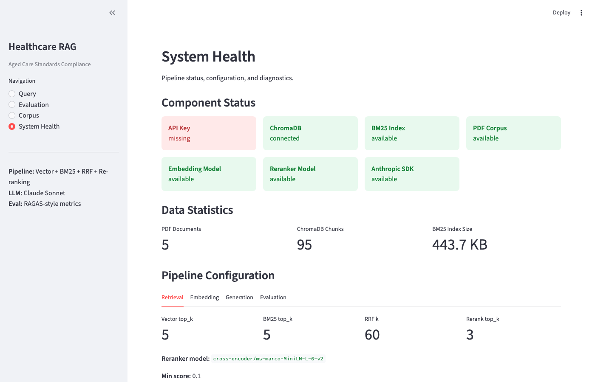

# Healthcare RAG System


Production-grade Retrieval-Augmented Generation pipeline for Australian Aged Care Quality Standards compliance. Ask natural language questions about the Strengthened Aged Care Quality Standards and get grounded, cited answers.

**Built by [GVRN-AI](https://gvrn-ai.com)** — AI governance and automation for healthcare.

## Dashboard

| Query Interface | Evaluation Results |
|---|---|
|  |  |

| Corpus Explorer | System Health |
|---|---|
|  |  |

## Architecture

```
                    ┌─────────────┐
                    │  User Query │
                    └──────┬──────┘
                           │
              ┌────────────┴────────────┐
              ▼                         ▼
     ┌────────────────┐       ┌─────────────────┐
     │ Vector Search  │       │  BM25 Search    │
     │ (ChromaDB)     │       │  (rank-bm25)    │
     │ top_k = 5      │       │  top_k = 5      │
     └────────┬───────┘       └────────┬────────┘
              │                        │
              └───────────┬────────────┘
                          ▼
                 ┌─────────────────┐
                 │  RRF Fusion     │
                 │  (k = 60)       │
                 └────────┬────────┘
                          ▼
                 ┌─────────────────┐
                 │ Cross-Encoder   │
                 │ Re-ranking      │
                 │ top_k = 3       │
                 └────────┬────────┘
                          ▼
                 ┌─────────────────┐
                 │ Claude Sonnet   │
                 │ Generation      │
                 │ + Citations     │
                 └─────────────────┘
```

## Evaluation Results

Evaluated against a 10-item golden dataset across 5 categories (clinical, factual, governance, cross-standard, out-of-scope):

| Metric | Score | Threshold | Status |
|--------|-------|-----------|--------|
| Faithfulness | 0.994 | 0.85 | PASS |
| Answer Relevancy | 0.901 | 0.80 | PASS |
| Context Precision | 0.883 | 0.75 | PASS |
| Citation Accuracy | 1.000 | 0.90 | PASS |

Evaluation uses a RAGAS-style LLM-as-judge framework with Claude Sonnet.

## Quick Start

```bash
# Clone and set up
git clone https://github.com/CloudAIX/healthcare-rag-system.git
cd healthcare-rag-system
python3 -m venv venv && source venv/bin/activate
pip install -r requirements.txt

# Configure
cp .env.example .env   # Add your ANTHROPIC_API_KEY

# Download corpus and ingest
python scripts/download_corpus.py   # 5 PDFs from aged care quality authority
python scripts/ingest.py            # Parse, chunk, embed → ChromaDB + BM25

# Run the API
uvicorn src.api.app:app --reload

# Or run the dashboard
streamlit run dashboard/app.py --server.port 8504
```

## Tech Stack

| Component | Tool |
|-----------|------|
| Vector Store | ChromaDB (PersistentClient) |
| BM25 Search | rank-bm25 (Okapi BM25) |
| Fusion | Reciprocal Rank Fusion (RRF) |
| Embeddings | all-MiniLM-L6-v2 (384 dims) |
| Re-ranking | cross-encoder/ms-marco-MiniLM-L-6-v2 |
| LLM | Claude Sonnet (Anthropic API) |
| Evaluation | Custom RAGAS-style framework (LLM-as-judge) |
| API | FastAPI + JWT + API key auth |
| Dashboard | Streamlit (4 pages) |
| Tracing | LangFuse (optional) |

## API Endpoints

All endpoints require authentication except `/health`.

| Route | Method | Auth | Rate Limit | Description |
|-------|--------|------|------------|-------------|
| `/health` | GET | None | — | System status + collection size |
| `/auth/token` | POST | API Key | 5/min | Exchange API key for JWT |
| `/query` | POST | API Key or JWT | 30/min | Query the RAG pipeline |

**Authentication:** Pass `X-API-Key` header or `Authorization: Bearer <jwt>` token.

```bash
# Health check
curl http://localhost:8000/health

# Get a JWT token (API key goes in the header AND the body — deliberate double-check)
curl -X POST http://localhost:8000/auth/token \
  -H "X-API-Key: your-api-key" \
  -H "Content-Type: application/json" \
  -d '{"api_key": "your-api-key", "client_id": "my-client"}'

# Query the pipeline
curl -X POST http://localhost:8000/query \
  -H "Authorization: Bearer <token>" \
  -H "Content-Type: application/json" \
  -d '{"question": "What are the documentation requirements for Standard 1?"}'
```

## Dashboard

Four-page Streamlit app for interactive exploration:

| Page | Description |
|------|-------------|
| **Query** | Interactive Q&A with sample questions, latency/cost metrics, chunk explorer |
| **Evaluation** | Golden dataset browser, metric averages vs thresholds, category breakdown |
| **Corpus** | PDF stats, chunking config, ChromaDB/BM25 status, parse preview |
| **System Health** | Component status cards, config tabs, environment check |

## Corpus

**Strengthened Aged Care Quality Standards** (effective 1 Nov 2025, Aged Care Act 2024):

- Aged Care Quality Standards document (49 pages)
- Guidance materials (intro + Standard 1)
- Quick reference guide
- Provider checklist

5 PDFs → 95 chunks after recursive chunking (2800 chars, 400 char overlap).

## Evaluation Framework

Custom RAGAS-style evaluation with four metrics:

- **Faithfulness** — LLM judge extracts claims from the answer, verifies each against retrieved context
- **Answer Relevancy** — LLM judge scores completeness, directness, specificity, correctness
- **Context Precision** — Average Precision computed by LLM judge (rewards relevant chunks ranked higher)
- **Citation Accuracy** — Pattern-based `[Source: ...]` verification against chunk metadata (no LLM needed)

```bash
# Run evaluation (requires ANTHROPIC_API_KEY)
python scripts/run_eval.py

# Offline mode (with precomputed answers)
python scripts/run_eval.py --offline

# Filter by category
python scripts/run_eval.py --category clinical
```

## Project Structure

```
healthcare-rag-system/
├── config/
│   ├── retrieval_config.yaml    # Pipeline configuration
│   └── prompts.yaml             # Generation prompts
├── src/
│   ├── ingestion/
│   │   ├── pdf_parser.py        # PyMuPDF extraction + section detection
│   │   ├── chunker.py           # Recursive text chunking
│   │   └── embedder.py          # SentenceTransformer + ChromaDB
│   ├── retrieval/
│   │   ├── retriever.py         # Hybrid retrieval orchestrator
│   │   ├── bm25_index.py        # BM25 index with persistence
│   │   ├── rrf_fusion.py        # Reciprocal Rank Fusion
│   │   └── reranker.py          # Cross-encoder re-ranking
│   ├── generation/
│   │   └── generator.py         # Claude Sonnet with citations
│   ├── evaluation/
│   │   ├── metrics.py           # 4 RAGAS-style metrics + LLM judge
│   │   ├── evaluator.py         # Evaluation orchestrator
│   │   └── dataset.py           # Golden dataset loader
│   └── api/
│       ├── app.py               # FastAPI application (v2.0.0)
│       └── security.py          # JWT + API key + rate limiting
├── dashboard/
│   ├── app.py                   # Streamlit main app
│   └── views/                   # query, eval, corpus, health pages
├── scripts/
│   ├── download_corpus.py       # Download PDFs from source
│   ├── ingest.py                # Parse + chunk + embed pipeline
│   └── run_eval.py              # Evaluation runner
├── tests/                       # 103/103 passing
├── eval/
│   └── golden_dataset.json      # 10 items, 5 categories
├── .env.example                 # All configurable env vars
└── requirements.txt
```

## Azure twin (Azure AI Search backend)

The retrieval layer is backend-switchable: the same corpus, chunker, embedding model and evaluation suite run against either local ChromaDB + BM25 or **Azure AI Search**, where vector + keyword hybrid happens in a single service call (the cross-encoder reranker still applies on top). Same embeddings both sides, so any quality difference is the store, not the model.

```bash
# 1. Provision (Terraform: resource group + AI Search, australiaeast to keep health data onshore)
cd infra/azure && terraform init && terraform apply
export AZURE_SEARCH_ENDPOINT=$(terraform output -raw search_endpoint)
export AZURE_SEARCH_KEY=$(terraform output -raw search_admin_key)

# 2. Ingest the same 95 chunks
python scripts/ingest_azure.py

# 3. Run anything against Azure
RAG_BACKEND=azure uvicorn src.api.app:app
RAG_BACKEND=azure python scripts/run_eval.py
```

Config lives in `retrieval_config.yaml` (`vector_store.backend`, `azure_search.index_name`); `RAG_BACKEND` overrides per process. Offline unit tests cover the mapping layer (`tests/test_azure_store.py`), so the suite stays green without an Azure subscription.

### Backend comparison — same golden dataset, same judge, same thresholds

Run 6 Sep 2026 against a live Azure AI Search service (free tier, australiaeast), identical MiniLM embeddings both sides:

| Metric | ChromaDB + BM25 + RRF | Azure AI Search hybrid | Threshold |
|---|---|---|---|
| Faithfulness | 0.994 | 0.961 | 0.85 — both pass |
| Answer relevancy | 0.901 | 0.826 | 0.80 — both pass |
| Context precision | 0.883 | 0.833 | 0.75 — both pass |
| Citation accuracy | 1.000 | 1.000 | 0.90 — both pass |

The local stack edges ahead on retrieval quality for this small corpus; Azure buys managed infrastructure, single-call hybrid search and an onshore (Australia East) data boundary. Both clear every threshold — which is the point: the evaluation harness, not the vendor, decides.

## MCP server (agents get governed access)

The retrieval layer is also exposed as a **Model Context Protocol** server, so any MCP client (Claude Code, Claude Desktop, or your own agents) can query the Standards with citations enforced at the tool boundary. All tools are read-only.

| Tool | What it does |
|---|---|
| `standards_search` | Hybrid retrieval + re-rank; every hit carries a `[Source: ...]` citation |
| `standards_get_chunk` | Full text of one chunk by id |
| `standards_ask` | Full RAG answer with citations (needs `ANTHROPIC_API_KEY`) |
| `standards_corpus_info` | Active backend + chunk count |

```bash
# Register with Claude Code (stdio; first call loads models, ~60s)
claude mcp add aged-care-standards -- \
  $(pwd)/venv/bin/python -m src.mcp_server.server
```

Honours `RAG_BACKEND=azure` like everything else. Offline tests in `tests/test_mcp_server.py`.

## Observability (you cannot govern what you cannot see)

Every API `/query` and MCP `standards_ask` records one trace: per-stage spans (retrieve / generate), token usage, cost, top retrieval score, backend and status. JSONL sink at `data/traces/traces.jsonl` — no external service required; set `LANGFUSE_PUBLIC_KEY` to mirror traces to Langfuse.

The dashboard's **Observability** page turns the sink into the numbers that matter: p50/p95 latency, latency by stage, cost per request, tokens in/out, error count, and a per-backend comparison (Chroma vs Azure on the same questions). Observability failures never break the request path.

## Deployment

```bash
# Container build (API only; dashboard runs separately)
docker build -t healthcare-rag .
docker run -p 8000:8000 --env-file .env -v $(pwd)/data:/app/data healthcare-rag
```

The `data/` volume carries the ingested ChromaDB collection and BM25 index — run `python scripts/ingest.py` once before first query. Models (~90MB) download on first start; allow ~60s before `Application startup complete`.

## Testing

```bash
python -m pytest tests/ -v
```

103/103 tests across 6 test suites: BM25 index, RRF fusion, reranker, hybrid retriever, evaluation metrics, API security.

## Configuration

All settings in `config/retrieval_config.yaml` and overridable via environment variables. See `.env.example` for the full list.

Key parameters:

| Parameter | Default | Description |
|-----------|---------|-------------|
| `ANTHROPIC_API_KEY` | — | Required. Anthropic API key |
| `ANTHROPIC_MODEL` | claude-sonnet-4-5-20250929 | Generation model |
| `EMBEDDING_MODEL` | all-MiniLM-L6-v2 | Embedding model |
| `TOP_K_VECTOR` | 5 | Vector search results |
| `TOP_K_BM25` | 5 | BM25 search results |
| `TOP_K_RERANK` | 3 | Final re-ranked results |
| `RAG_API_KEY` | — | API authentication key |

## License

MIT
